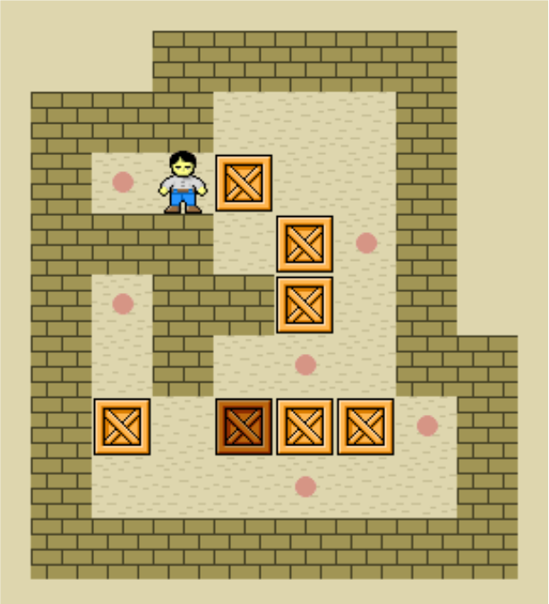
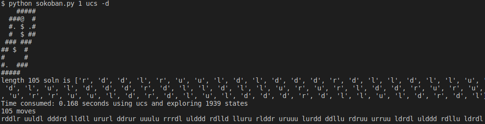

# Sokoban Solver
<kbd></kbd> 

An AI program that computes the optimal solution to a sokoban puzzle  
  
[Info](https://en.wikipedia.org/wiki/Sokoban)  
[Guidelines](assets/hw4_questions.pdf)  
[Demo](https://sokoban.info/)  
  
Using A* search, and a user-defined Heuristic function to determine the solution to complete various sokoban puzzle with the least cost, while factoring in the constraints of the puzzle such as pushing only one box in a row and no pulling allowed.
  
[Dead-end detection](http://www.sokobano.de/wiki/index.php?title=Deadlocks)  
Dead square deadlock and freeze deadlock are used  

<kbd></kbd>  
<kbd></kbd> 
