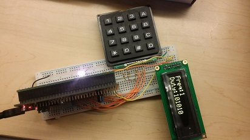
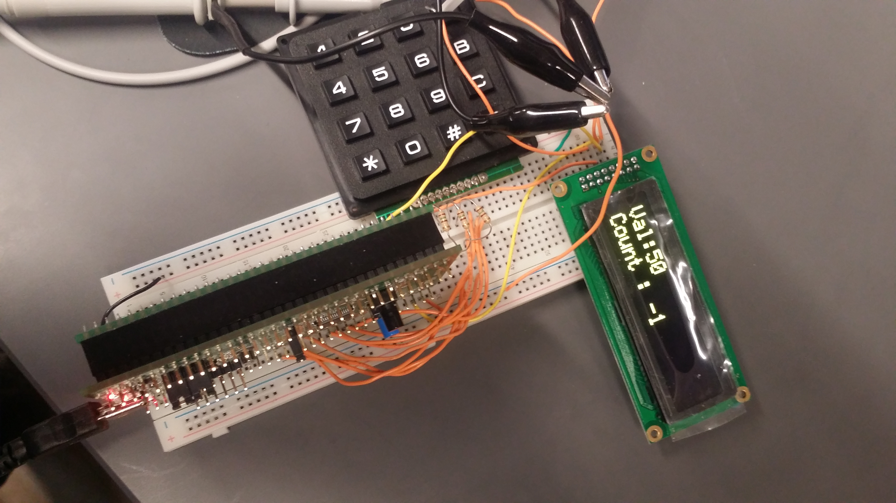
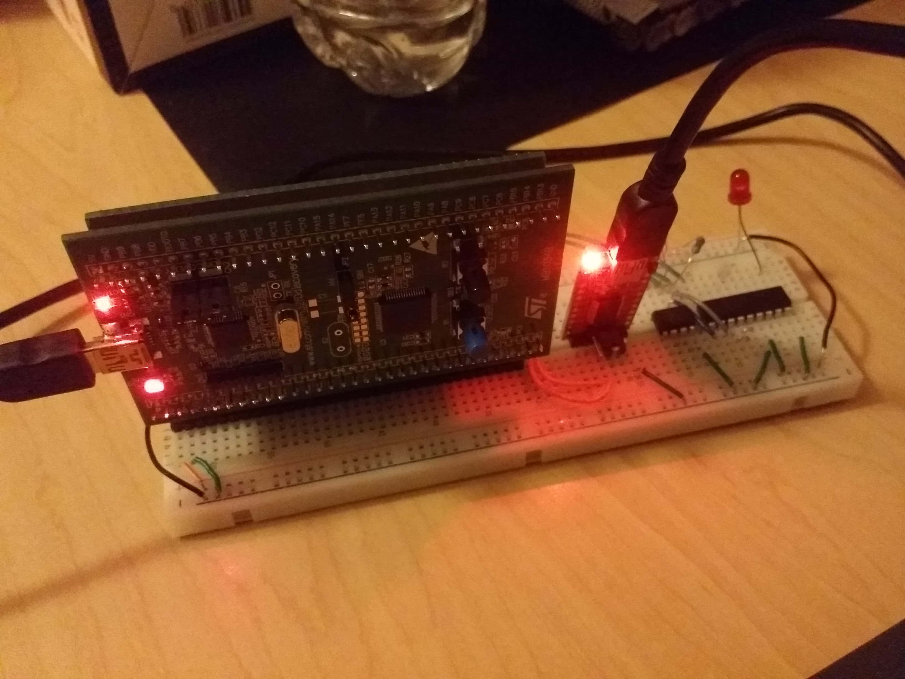

# ECE 362 Microprocessor Systems and Interfacing

Tools required:  
System Workbench for STM32  
STM32F0-DISCOVERY development board  
Analog Discovery 2  

Lab 01 - Code operations  

Lab 02 - Data segment allocation  

Lab 03 - General Purpose Input/Output  

Lab 04 - Interruption and Handlers  

Lab 05 - Timers   

Lab 06 - DAC and ADC  

Lab 07 - Pulse Width Modulation  
Include [lcd_driver.o](lab07/lcd_driver.o)  

  
Lab 08 - SPI and DMA  

Lab 09 - I2C Communication  

Lab 10 - USART Communication
